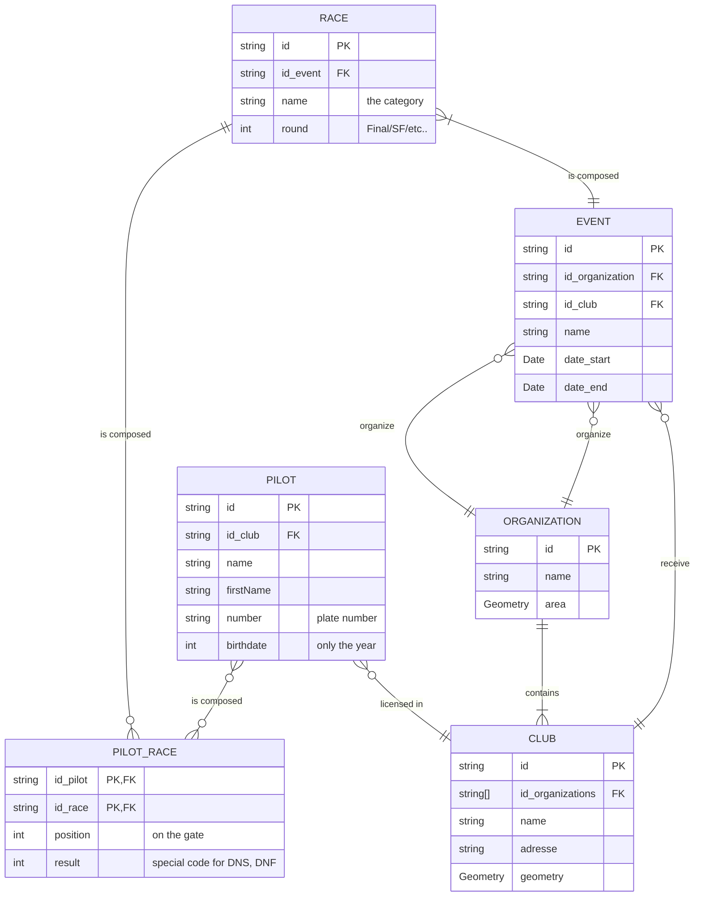

# Datas Description

```mermaid
erDiagram
    ORGANIZATION ||--|{ CLUB : contains
    PILOT }o--|| CLUB : " licensed in"
    EVENT }o--|| CLUB : "receive"
    EVENT }o--|| ORGANIZATION : "organize"
    EVENT }o--|| ORGANIZATION : "organize"
    RACE }|--|| EVENT : "is composed"
    PILOT }o--o{ PILOT_RACE : "is composed"
    RACE ||--o{ PILOT_RACE : "is composed"
    
    ORGANIZATION {
        string id PK
        string name
        Geometry area
    }
    CLUB {
        string id PK
        string[] id_organizations FK
        string name
        string adresse
        Geometry geometry
    }
    
    PILOT {
        string id PK
        string id_club FK
        string name
        string firstName
        string number "plate number"
        int birthdate "only the year" 
    }

    EVENT {
        string id PK
        string id_organization FK
        string id_club FK
        string name
        Date date_start
        Date date_end
    }

    RACE {
        string id PK
        string id_event FK
        string name "the category"
        int round "Final/SF/etc.."
    }

    PILOT_RACE {
        string id_pilot PK,FK
        string id_race PK,FK
        int position "on the gate"
        int result "special code for DNS, DNF" 
    }

```
